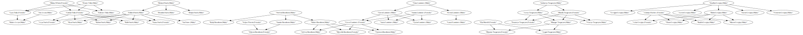

# craft ai Project

This project aims to help Westerosi Maesters figure out the lines of successions in the noble families.

They use as input the dataset `got_families.csv` which represents the state of the different houses at the beginning of the books.

The data is presented in the following form:

|parent_name  |parent_sex|child_name    |child_sex|
|-------------|----------|--------------|---------|
|Rickard Stark| M        | Eddard Stark | M       |
|Rickard Stark| M        | Brandon Stark| M       |
|Rickard Stark| M        | Benjen Stark | M       |

An SVG for easier visualization is provided at https://github.com/tiberiusferreira/craft-ai-project/blob/master/got_families.svg and shown below. It was generated using the [Lineage::to_graphviz](https://github.com/tiberiusferreira/craft-ai-project/blob/e93114191b264f7c8177091fdc12b2df330eaf65/src/lineage/mod.rs#L174) function and rendering the graphviz using http://www.webgraphviz.com/.

## Succession rules

Here are the succession rules for the Westeros houses (neither book nor show accurate). 

Because we are not really sure on anyone's age, the Maesters are forgetful sometimes, 
the alphabetical order is used to break ties.

- Sons
- Brothers
- Nephews (son of the brother or sister)
- Daughters
- Sisters
- Nieces (daughter of the brother or sister)
- Any remaining member of the house

## Usage

Clone the repository and run `cargo run --release`.

A webserver should be started at 127.0.0.1:3030 with two endpoints:

----
### Next in line

**Description** : Returns who is next in line for the title of person named {name}.

**URL** : `/successor/?{name}` name is passed as an url encoded query parameter

**Method** : `GET`

#### Success Response

**Code** : `200 OK`

**Body** : Successors name (String)

#### Error Responses

On person not found

**Code** : `404 NOT_FOUND`

**Example**

GET /successor?name=Tytos%20Lannister

**Code** `200 OK`

**Body** `Kevan Lannister`

----

### Kill person

**Description** : Kills the person named {name}.

**URL** : `/kill/?{name}` name is passed as an url encoded query parameter

**Method** : `POST`

#### Success Response

**Code** : `200 OK`

**Body** : Killed {name} successfully or {name} was already dead

#### Error Responses

On person not found

**Code** : `404 NOT_FOUND`

**Example**

POST /kill?name=Kevan%20Lannister

**Code** `200 OK`

**Body** `Killed Kevan Lannister successfully`

